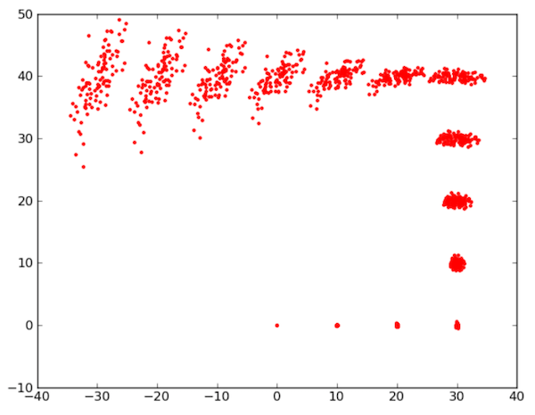

# Práctica 2 de Robots Móviles 2019/20. Mapeado y localización

En esta práctica vamos a trabajar con varios conceptos que estamos viendo en las sesiones teóricas: estimación del modelo de error de la odometría de un robot, construcción de mapas 2D y localización en un mapa previamente construido. Trabajaremos con el robot Turtlebot v2 tanto en entorno simulado como real, de forma que veremos el funcionamiento de algoritmos de localización y mapeado en ambos entornos.

La práctica tiene varias partes: en las dos primeras no es necesario que escribáis código, solo que probéis las funcionalidades ya implementadas en ROS. Para la tercera parte y alguna de las partes optativas tendréis que escribir algo de código.

> Para realizar las dos primeras partes tendréis que consultar documentación adicional. Podéis consultar por ejemplo los capítulos 9 y 10 del libro *"Programming Robots with ROS"*, de Quigley, Gerkey y Smart, ed. O'Reilly, 2015. Podéis [consultarlo *online*](https://www.oreilly.com/library/view/programming-robots-with/9781449325480/?ar) por medio de los servicios de la biblioteca de la UA. No obstante podéis usar cualquier otro libro y/o tutoriales, videos, artículos, cursos ...que podáis encontrar en Internet. A través de la propia biblioteca hay disponibles muchos otros [libros en formato electrónico](https://ua.on.worldcat.org/search?databaseList=1953%2C1931%2C1875%2C1941%2C2259%2C2237%2C3313%2C2375%2C239%2C2570%2C638%2C2260&queryString=ros+robots&clusterResults=true) sobre ROS.

## Parte 1: Construcción de mapas del entorno (requisito mínimo)

En esta primera parte de la práctica nos centraremos en la generación de mapas 2D del entorno utilizando los sensores disponibles en el robot Turtlebot v2. Este mapa se utilizará posteriormente para la localización del robot en el entorno. Utilizaremos los paquetes disponibles en ROS para la construcción de mapas. Antes de lanzarnos a utilizar el robot real, probaremos estos algoritmos sobre el entorno simulado Gazebo. Para ello puedes diseñar un escenario en Gazebo o utilizar alguno de los ya existentes/disponibles online. Para el manejo del robot puedes utilizar un nodo para la teleoperación del robot mediante teclado, o también puedes usar el código de la práctica 1 para mover el robot. Una vez construido el mapa del entorno sintético debes exportarlo a un formato que se pueda reutilizar más adelante.

En la documentación debes responder como mínimo a las siguientes preguntas.

 - ¿Qué paquete has utilizado en ROS para generar el mapa del entorno?
 - ¿Cuál es la resolución del mapa generado (cuánto es cada celdilla en el mundo real) y qué formato de representación se ha utilizado?
 - ¿Qué parámetros hay disponibles en el paquete de generación de mapas y como los has utilizado para mejorar la reconstrucción del entorno? Explica qué parámetros han tenido más impacto en la reconstrucción final.
 - ¿En qué tipo de entornos crees que funciona mejor y peor el algoritmo de mapeado? (pasillos, habitaciones, espacios abiertos, espacios cerrados,...)

Para poder repetir una misma prueba variando los parámetros del algoritmo podéis grabar los datos de los sensores en un fichero  `rosbag`. Este `rosbag` se puede "reproducir" posteriormente las veces que haga falta como si fuera información que el robot está recibiendo "en vivo", pudiéndose así repetir un experimento varias veces con los mismos datos de entrada.

## Parte 2: Localización (requisito mínimo)

En esta sección vamos a utilizar los mapas que hemos construido previamente. Utilizando estos mapas vamos a evaluar un algoritmo de localización ya implementado en ROS. De esta forma seremos capaces de localizar el robot sobre el mapa preconstruido utilizando para ello información de sus sensores.

De igual forma que en la sección anterior, lleva a cabo los experimentos inicialmente en el entorno sintético y posteriormente utiliza datos del robot real. La localización del robot sobre el mapa preconstruido tendrá que llevarse a cabo con datos nuevos capturados por el robot, es recomendable realizar grabaciones en formato rosbag para poder trabajar offline y probar distintos parámetros del algoritmo elegido. 

Una vez llevadas a cabo las pruebas sobre localización, incluye como mínimo la siguiente información en la memoria de la práctica:

- Describe el algoritmo utilizado para llevar a cabo la localización del robot en el mapa preconstruido.
- Describe los parámetros del algoritmo utilizado, así como su influencia en la localización del robot en el entorno.
- ¿Funciona siempre correctamente el algoritmo de localización o falla en algunos casos? 

## Parte 3: Implementación del modelo de movimiento basado en odometría (requisito adicional)

En esta sección vamos a simular el modelo de error basado en la odometría del robot (visto en clase de teoría). El programa dibujará por pantalla la posición de las muestras en cada paso para una secuencia de movimientos del robot dada por las posiciones medidas por la odometría. El resultado será algo similar a esto:

 

Para llevar a cabo la implementación podeis utilizar la plantilla que os proporcionamos en Python.

En el código la clase `Pose` representa una posible posición del robot (\\(x,y,\theta)\\).

Para llevar a cabo el modelado del error tendrás que implementar las dos funciones principales: `sample_normal_distribution` y `sample_motion_model`

- En la función `sample_normal_distribution(b)` debes devolver una muestra de una distribución normal de media 0 y desviación típica `b`.
- En la función `sample_motion_model` debes implementar el algoritmo del mismo nombre que vimos en teoría (transparencia 28 del tema 3, parte I). Cuidado, a diferencia del algoritmo de teoría, que tiene como entrada \\(\delta_{rot1}, \delta_{rot2}, \delta_{trans}\\) la función Python recibe la `Pose` medida por la odometría en el instante actual y en el previo. A partir de estas dos `Pose`s puedes calcular los  \\(\delta\\)  (cómo calcularlos en la transparencia 14 del tema 3 parte I).

El programa recibe dos parámetros en línea de comandos:

1. Fichero de odometría: fichero que contiene las posiciones medidas por la odometría del robot. Cada línea contendrá tres números \\( x,y,  \theta\\). Ya se os da implementado código Python que lee estos datos y los coloca en un array de objetos `Pose` 
2. Número de muestras

Un ejemplo de ejecución del programa sería el siguiente:

```bash
python practica1.py odometria.txt 500
```

En el código debes ajustar los cuatro parámetros de error que vimos en clase de teoría, \\( \alpha_1, \alpha_2, \alpha_3, \alpha_4\\). Prueba el algoritmo utilizando distintas secuencias de odometría y distintos parámetros de error. Incorpora a la memoria las gráficas generadas y comenta brevemente el resultado obtenido para cada una de las secuencias.

## Entrega de la práctica

### Baremo

> Como su nombre indica **los requisitos mínimos deben realizarse obligatoriamente para poder aprobar la práctica**. Del resto de requisitos podéis elegir los que queráis. Tened en cuenta que todos los puntos que se proponen suman más de 10 por lo que no es necesario que los hagáis todos, ya que **en cada práctica no os puedo poner una nota superior al 10**.

- **Requisitos mínimos (hasta un 5)**: realización de las partes 1 y 2 de la práctica en el simulador. La práctica debe estar adecuadamente documentada, respondiendo como mínimo a las preguntas que se plantean y detallando los resultados de todos los experimentos realizados. Probad al menos un par de entornos de los que hay en ROS o que encontréis ya construidos por internet.

> IMPORTANTE: si luego vais a probar los algoritmos en el robot real, para poder comparar mejor el funcionamiento simulado y el real deberíais intentar añadir el sensor laser a la simulación, ya que por defecto el simulador usa una cámara 3D, que tiene mucha menor resolución. Aquí tenéis [un tutorial](https://bharat-robotics.github.io/blog/adding-hokuyo-laser-to-turtlebot-in-gazebo-for-simulation/) para hacerlo pero podéis encontrar la información en otros sitios en Internet.

- **(hasta 1 punto adicional)** probar los algoritmos en un mundo simulado construido por vosotros. Intentad construir un mundo que tenga partes sencillas de mapear y partes difíciles o bien un mundo "fácil" y uno "difícil" y intentad explicar por qué le resultan fáciles o difíciles al algoritmo.
- **(hasta 1 punto adicional)** implementación del modelo del sensor (apartado 3 de la práctica)
- **(hasta 1 punto adicional)** implementación de un modelo de sensor de rango basado en haz de luz como el visto en clase de teoría (transparencias 39-41 tema 3 parte I). Debéis implementar una función `sensor_model` a la que se le pase como parámetro la distancia al obstáculo más cercano en metros y otra distancia adicional y nos devuelva la probabilidad de que el sensor mida esta última distancia. En la memoria de la práctica debéis incluir un gráfico de la probabilidad según la distancia (ir generando valores de distancia y ploteando el valor que devuelva `sensor_model`). 
- **(hasta 2 puntos adicionales)** prueba de los algoritmos de mapeado y localización en los turtlebot reales. Para obtener los dos puntos hay que probar al menos dos mapas reales diferentes y localizarse en ellos (idealmente deberían ser parecidos a los probados en la simulación), experimentar con distintos valores de los parámetros de los algoritmos en cada mapa, y documentar todo el proceso y las conclusiones a las que hayáis llegado (diferencias entre cómo ha funcionado todo en la simulación vs. turtlebot real, si las hay). 
- **(hasta 1 punto adicional)**: comprobar experimentalmente el error del sensor de rango laser y los errores de odometría de los turtlebot reales. 
    + Para medir los errores del sensor debéis colocar al robot frente a un obstáculo (a ser posible a distancia conocida) y tomar un gran número de medidas. Si el entorno es estático y el robot no se mueve, teóricamente las medidas no deberían variar pero en la realidad lo harán. Podéis hacer un histograma de las medidas obtenidas para ver si efectivamente tiene forma gaussiana y si se dan también errores aleatorios o de rango máximo.
    + Para medir los errores de odometría podéis conducir al robot manualmente por algún camino de medidas conocidas e ir grabando los datos de la odometría (topic `/odom`), que podríais representar gráficamente junto con la ruta seguida en la realidad.
- **(hasta 1 punto adicional)** tomar alguna implementación ya existente en internet de un algoritmo de localización (sea o no de ROS), examinar el código fuente y detallar su funcionamiento, tanto del código en si (incluir comentarios indicando qué hace cada parte del código) como de las pruebas que  hayáis realizado sobre el mismo. Redactarlo en forma de tutorial para que pueda servir a otros compañeros que quieran probar la implementación y saber cómo funciona.
- **(hasta 2 puntos adicionales)** implementar cualquiera de los algoritmos de localización que se verán en la asignatura: filtros de partículas, EKF o histogramas. Si se detecta que habéis tomado el código de algún sitio en lugar de escribirlo vosotros implicará el suspenso automático en la práctica. En principio bastará con que lo probéis en un entorno simulado, sea ROS, sea otro simulador o una simulación simplificada que os construyáis vosotros.
- Cualquier otra idea que se os ocurra relacionada con el mapeado y la localización. Consultad con el profesor para ver cuánto se podría valorar en el baremo.

### Formato de la documentación 

La documentación en un formato portable y multiplataforma como PDF o HTML. Podéis incluir videos capturados del simulador o del robot real o los ficheros rosbag de los experimentos.

### Plazos y procedimiento de entrega

La práctica se podrá entregar hasta las 23:59 horas del **martes 19 de Noviembre del 2019**.

La entrega se realizará a través del Moodle de la asignatura.

## Apéndice: uso de `rosbag`

El paquete `rosbag` es un conjunto de herramientas para grabar y reproducir topics en ROS. Proporciona una herramienta de línea de comandos llamada `rosbag` para trabajar con *bags*, así como APIs de código para leer/escribir estas grabaciones en C++ y Python.

A continuación se muestra la lista de operaciones soportadas por el comando `rosbag`:

- record: Graba en un fichero bag el contenido de los topics especificados.
- info: Muestra un resumen del contenido de un fichero bag. 
- play: Reproduce el contenido de uno o más ficheros bag.
- check: Comprueba si el fichero bag es reproducible en el sistema actual o si puede ser migrado a otro sistema.
- fix: Repara los mensajes en un fichero bag de forma que se pueda repro- ducir en el sistema actual.
- filter: Convierte un fichero bag utilizando expresiones de Python. compress: Comprime uno o más ficheros bag.
- decompress: Descromprime uno o más ficheros bag.
- reindex: Reindexa uno o más ficheros bag que esten corruptos.

### Grabación de datos

Esta sección muestra como grabar datos de los *topics*. Todos los datos de los *topics* que grabemos se acumularán en un fichero bag.

Veamos un ejemplo usando el paquete  `turtlesim` que nos permite controlar una especie de "tortuga" en pantalla. Ejecutaremos los siguientes comandos en distintas terminales:

```bash
roscore
rosrun turtlesim turtlesim_node
rosrun turtlesim turtle_teleop_key
```

Esto iniciará dos nodos - el nodo visualizador y un nodo que permite el control por teclado del robot usando las teclas de flechas en el teclado. Si seleccionas la ventana de terminal desde la que lanzó turtle_keyboard, deberías ver algo como lo siguiente:

```bash
 Reading from keyboard
---------------------------
Use arrow keys to move the turtle.
```

Presionando las flechas del teclado el robot turtlebot se moverá por la panta- lla. Ten en cuenta que para mover el robot debes tener seleccionada la terminal desde la que lanzaste a Turtlesim y no la ventana de Turtlesim.
En caso de que ya tuvieses el robot real funcionando u estuvieses utilizando otros nodos que publican datos no es necesario la ejecución de los comandos anteriores.

### Grabación de todos los topics

Primero vamos a examinar la lista completa de topics que están siendo pu- blicados en el sistema en ejecución. Para ello, abre un nuevo terminal y ejecuta el comando:

```bash
rostopic list -v
```

si has ejecutado el Turtlesim anteriormente deberías ver la siguiente salida por pantalla:

```bash
Published topics:
* /turtle1/color_sensor [turtlesim/Color] 1 publisher
* /turtle1/cmd_vel [geometry_msgs/Twist] 1 publisher
* /rosout [rosgraph_msgs/Log] 2 publishers
* /rosout_agg [rosgraph_msgs/Log] 1 publisher
* /turtle1/pose [turtlesim/Pose] 1 publisher
Subscribed topics:
* /turtle1/cmd_vel [geometry_msgs/Twist] 1 subscriber
* /rosout [rosgraph_msgs/Log] 1 subscriber
```

La lista de topics publicados es el único tipo de mensaje que podría gra- barse en el archivo de registro de datos, ya que sólo se graban los mensajes publicados. El tema /turtle1/cmd_vel es el mensaje de comando publicado por teleop_turtle que es tomado como entrada por el proceso turtlesim. Los mensajes /turtle1/color_sensor y /turtle1/pose son mensajes de salida publicados por turtlesim.

Ahora grabaremos los datos publicados. Abre una nueva ventana de terminal. En esta ventana ejecuta los siguientes comandos

```bash
mkdir bagfiles
cd bagfiles
rosbag record -a
```
con estas intrucciones estamos creando un directorio temporal para grabar los datos y luego ejecutando el comando `rosbag` con la opción `-a`, indicando que todos los temas publicados deben ser acumulados en un archivo bag.

Vuelve a la ventana del terminal con `turtle_teleop` y mueve el robot durante unos 10 segundos. En la ventana que ejecuta `rosbag record` pulsa Ctrl-C para terminar la grabación. Ahora examina el contenido del directorio `bagfiles`. Deberías ver un archivo con un nombre que comience con el año, la fecha, la hora y el sufijo `.bag`. Este es el archivo que contiene todos los datos publicados por cualquier nodo en el momento en que se estaba ejecutando el comando `rosbag record`.

### Grabar solo algunos *topics*

Dado que pueden haber muchos topics publicando información, puede desearse grabar solo cierta información publicada por algunos topics. Por ello es posi- ble especificar al comando `rosbag record` los topics en particular que se desean grabar.

```bash
rosbag record -O subset /turtle1/cmd_vel /turtle1/pose
```

El argumento `-O` le dice al comando `rosbag` que se grabe en un archivo llamado `subset.bag`, y los argumentos del comando hacen que sólo se suscriba a estos dos temas. Mueva el robot en el simulador durante varios segundos usando los comandos de flecha del teclado, y luego pulsa Ctrl-C para terminar la grabación.

### Examinando ficheros bag

Ahora que sabemos como grabar un archivo *bag* po demos examinarlo y reproducirlo usando los comandos `rosbag info` y `rosbag play`. Primero vamos a ver lo que está registrado en el archivo *bag*. 

Podemos ejecutar el comando `rosbag info` – este comando comprueba el contenido del archivo bag sin reproducirlo. Ejecuta el siguiente comando desde el directorio *bagfiles*:

```bash
rosbag info <your bagfile>
```

Deberías ver algo como lo siguiente:

```bash
path: 2014-12-10-20-08-34.bag
version: 2.0
duration: 1:38s (98s)
start: Dec 10 2014 20:08:35.83 (1418270915.83)
end: Dec 10 2014 20:10:14.38 (1418271014.38)
size: 865.0 KB
messages: 12471
compression: none [1/1 chunks]
types:       geometry_msgs/Twist [9f195f881246fdfa2798d1d3eebca84a]
rosgraph_msgs/Log [acffd30cd6b6de30f120938c17c593fb]
turtlesim/Color [353891e354491c51aabe32df673fb446]
turtlesim/Pose [863b248d5016ca62ea2e895ae5265cf9]
topics: /rosout  4 msgs : rosgraph_msgs/Log   (2 connections)
/turtle1/cmd_vel      169 msgs  : geometry_msgs/Twist
/turtle1/color_sensor 6149 msgs : turtlesim/Color
/turtle1/pose         6149 msgs : turtlesim/Pose
```
Esto nos indica los nombres y tipos de *topics*, así como el número de mensajes de cada topic contenidos en el archivo bag. Podemos ver que de los temas que se anunciaron que vimos en la salida del rostopic, cuatro de los cinco fueron publicados realmente sobre nuestro intervalo de grabación. Mientras corríamos el comando `rosbag` con el parámetro `-a`, grababa todos los mensajes publicados por todos los nodos.

### Reproduciendo ficheros bag

Al reproducir un fichero bag se están volviendo a enviar los mismos mensajes que en la situación original, podemos emplear esta funcionalidad para ejecutar pruebas siempre con la misma secuencia de datos de entrada.

Primero mata el programa de teleoperación que puede estar todavía ejecutándose desde la sección anterior - Ctrl-C en la terminal donde iniciaste `turtle_teleop_key`. Deja a Turtlesim corriendo. En una ventana de terminal ejecuta el siguiente comando en el directorio donde grabaste el archivo bag original:

```bash
rosbag play <your bagfile>
```

En esta ventana deberías una salida como la siguiente:

```bash
 [ INFO] [1418271315.162885976]: Opening 2014-12-10-20-08-34.bag
Waiting 0.2 seconds after advertising topics... done.
Hit space to toggle paused, or 's' to step.
```

Una opción interesante del comando `rosbag play` es el parámetro `-r`. Esta opción nos permite especificar la frecuencia de la publicación de mensajes.

```bash
rosbag play -r 2 <your bagfile>
```

Con el comando anterior estamos publicando los mensajes al doble de velocidad de como se grabaron.

